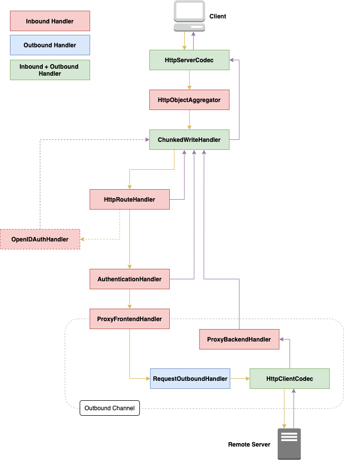
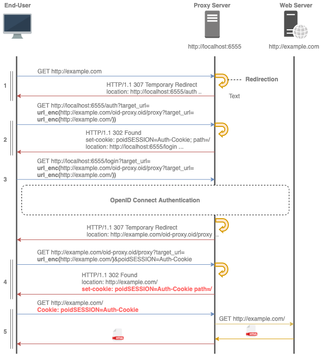
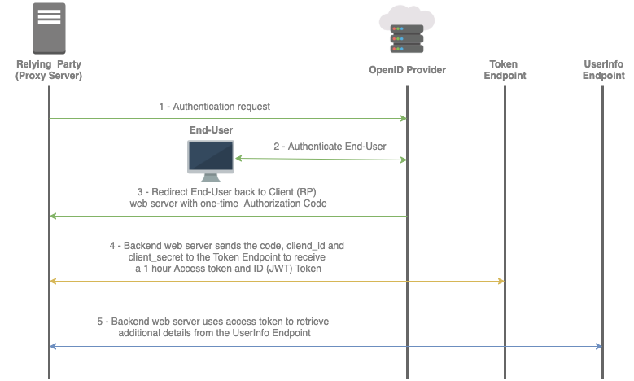

# ProxyServer-OpenID

This project implements an HTTP forward proxy server with OpenID Connect authentication. This means that a user can access the internet only if he is authenticated, otherwise he will be forwarded to an authentication page of the OpenID Connect provider. 

The proxy server implementation, besides forwarding the requests and responses, should also be modular and easily extensible. To achieve this the server features will be implemented in separate handlers through which the requests and/or responses will be passing. In other words, we will have handlers for decoding and encoding HTTP messages, providing authentication, file encoding, as well as providing the ability to easily add features such as logging or blacklisting. 

## Table of Contents

- [Server Pipeline](#server-pipeline)
- [Authentication Flow](#authentication-flow)
  - [OpenID Connect](#openid-connect-flow) 
- [Build Project](#build-project)
- [Configuration](#configuration)

## Server Pipeline

The proxy server was implemented using Netty. Netty is an efford to provide an asynchronous event-driven network application framework for the development of maintainable high-performance and high-scalability protocol servers and clients. In Netty, a list of channel handlers in a channel pipeline handles or intercepts inbound events and outbound operations of a Channel. Each channel has its own pipeline which is created automatically when a new channel is created. This pipeline implements an advanced form of the Intercepting Filter pattern to give a user full control over how an event is handled and how the channel handlers in a pipeline interact with each other.

The handlers in a channel pipeline are visualized below.

<p align="center">
  
</p>
<!--  -->

## Authentication Flow

This project focuses on implementing a proxy server which requires an authentication using the OpenID Connect authentication protocol. This protocol is not supported by the traditional HTTP proxy authentication, so a new authentication flow was necessary for achieving the goal. This authentication flow uses cookie based authentication in combination with three way redirection.

The authentication flow is shown below.

<p align="center">
  
</p>
<!--  -->

### OpenID Connect Flow

<p align="center">
  
</p>
<!--  -->

## Build Project

Build the project from source code:

```bash
git clone https://github.com/filipovskid/ProxyServer-OpenID.git
cd ProxyServer-OpenID

mvn clean package
```

## Configuration

The proxy configuration should be available in the resources file `config.yml`. An example configuration can be found in `config-example.yml`:

```yaml
# Server config
port: 6555
host: "localhost"

# OpenID Connect config
client_id: "173786..e0n1.apps.googleusercontent.com"
client_secret: "mS9..WiNE"
redirect_uri: "http://localhost:6555/code"

discovery_document: "https://accounts.google.com/.well-known/openid-configuration"
authorization_endpoint: "https://accounts.google.com/.well-known/openid-configuration"
token_endpoint: "https://oauth2.googleapis.com/token"
userinfo_endpoint: "https://openidconnect.googleapis.com/v1/userinfo"
```
